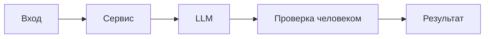

# ADR: решение для первого рабочего сценария

Файл ведёт OpenCode. Обсудите с агентом содержание и проверьте предложенный diff. Все дополнения и исправления поручайте агенту в чате.

- Статус: accepted
- Дата: 2026-10-07
- Ответственные: студент (ревьюер), OpenCode (рабочий агент)

## Контекст

Учебный кейс: ассистент ревьюера PR по одному diff (TRAINING_PR.diff). В сервисе добавлен endpoint POST /api/reviews, вызывающий ReviewService.review(diff), который формирует промпт и вызывает LLM. Требования к версии Python и синхронности клиента LLM — открытые вопросы, не фиксируются в этом ADR.
## Решение

Использовать Master Prompt v1 для ассистента ревьюера:

- Вход: один unified diff PR.
- Выход: Summary; до 3 Risks с file/line/evidence; Checks с воспроизводимыми шагами.
- Ограничения: не выходить за пределы diff; не представлять предположения как факты; AI не принимает решений и не меняет код.
## Рассмотренные альтернативы

| Альтернатива | Почему не выбрали сейчас |
|---|---|
| Свободная форма ответа | Низкая доказательность и воспроизводимость, по результатам P1-01 |
| Расширение полномочий AI (approve/merge) | Противоречит правилам кейса и процессу человеко-решения |

## Последствия и главный риск

- Положительные последствия:
  - Повышение доказательности ревью; воспроизводимость проверок; улучшение фокуса на diff.
- Ограничения:
  - Ответ зависит от качества diff; без дополнительных источников не оцениваются нефункциональные аспекты.
- Главный риск:
  - Недостаток контекста может приводить к пропущенным рискам.
- Как проверим риск:
  - Сравнение результатов P1-01 и P1-02; добавление открытых вопросов в ответ без превращения их в требования.

## Архитектурная схема

## Как использовали AI

 - Для чего: подготовить и зафиксировать архитектурное решение для первого сценария, альтернативы и последствия.
- Тип промпта: master prompt (P1-02)
- Строка в [`prompts.md`](prompts.md): P1-02, P1-03
- Что проверил студент и какие исправления поручил агенту: задокументирован формат результата, контекст и ограничения; альтернативы и риски оценены на основе ответов P1-01 и P1-02.
