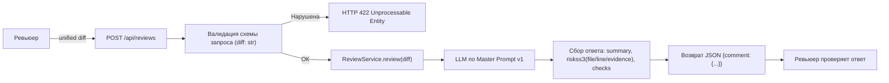

# Анализ процесса: AS IS и TO BE

Файл ведёт OpenCode. Обсудите с агентом содержание и проверьте предложенный diff. Все дополнения и исправления поручайте агенту в чате.

## AS IS

В рамках учебного кейса:

- Вход: один unified diff PR (TRAINING_PR.diff).
- Пользователь: ревьюер.
- Сервис: FastAPI-приложение с POST /api/reviews, принимающее payload: dict и обращающееся к review_service.review(payload["diff"]).
- Логика: ReviewService.builds prompt "Review this pull request and find problems:\n{diff}", вызывает llm.generate и возвращает {"comment": answer}.
- Точки риска по diff:
  - app/api.py:35-37 — обращение к payload["diff"] без валидации вызывает KeyError при отсутствии ключа и приводит к 500.
  - Структура ответа сервиса — один ключ comment, без структурированных полей summary/risks/checks.

## TO BE

Один целевой процесс (без требований к версии Python и реализации клиента LLM).

- Рекомендуется (необязательно) сопровождать пункты TO BE краткой подсказкой в скобках: изменение → как наблюдать/проверить → источник (при наличии). Пример: «Валидация входа (изменение: схема diff → видно: 422 при {} → источник: tests_integration.md)». Подсказка носит пояснительный характер и не добавляет новых требований.

- Вход: тело запроса — JSON-объект c полем diff: str. Поле валидируется схемой запроса. При отсутствии поля diff или несоответствии типа возвращается 422 Unprocessable Entity.
- Обработка: сервис вызывает ReviewService.review(diff). ReviewService формирует промпт вида:
  "Review this pull request and find problems:\n{diff}", вызывает llm.generate и приводит ответ к согласованному формату.
- Выход: JSON с одним верхнеуровневым полем comment. Поле comment — объект со структурой:
  - summary: краткое описание изменения;
  - risks: массив до 3 элементов; каждый элемент содержит:
    - file (строка/путь);
    - line (номер или диапазон строк);
    - evidence (цитата из unified diff, подтверждающая вывод);
  - checks: список воспроизводимых проверок (шаги и ожидаемые результаты).
- Правила: запрещены предположения без ссылки на diff/источник; решение принимает человек. Формат результата и ограничения соответствуют context.md и product_management.md; для генерации используется Master Prompt v1 (см. P1-02).

### Ссылки на источники (RAG)
- product_management.md — формат ответа JSON {comment{summary, risks≤3(file/line/evidence), checks}}; ограничение risks≤3; негативный сценарий 422 при отсутствии diff
- tests_e2e.md — подтверждение структуры результата (summary, до 3 risks с file/line/evidence, checks)
- tests_integration.md — негативный сценарий (AS IS: 500; TO BE: 422) и наличие поля comment в ответе сервиса
- context.md — правила доказательности: ссылки на файл/строку, evidence как цитата из diff; запрет предположений вне diff

Примечание (ReAct): согласованность TO BE подтверждена сопоставлением с product_management.md, tests_e2e.md, tests_integration.md и context.md (см. practices/practice_02/react/experiment.md).

## Разница

| Что меняется | AS IS | TO BE | Как проверим изменение |
|---|---|---|---|
| Валидация входа | Нет — payload["diff"] выбрасывает KeyError | Есть — отсутствие/невалидное поле diff -> 422 | Интеграционный негатив: POST /api/reviews c {}. AS IS: 500 (KeyError). TO BE: 422. См. Checks C1 в P1-02 |
| Формат ответа API | {"comment": строка}, несогласованный | {"comment": {summary, risks<=3, checks}} | E2E позитивный: POST /api/reviews с валидным diff. Ожидаем: comment.summary присутствует; risks длиной ≤3; у каждого risk есть file, line, evidence (цитата). Подтверждение: P1-02.json |
| Ограничение на риски и доказательства | Риски не структурированы; ссылки не обязательны | До 3 рисков, каждый с file/line и обязательной evidence (цитатой из diff) | Просмотр P1-02.json: у каждого risk есть file, line, evidence; количество рисков ≤3 |
| Использование Master Prompt | Не зафиксировано | Зафиксирован Master Prompt v1 | Сравнить P1-01 и P1-02: во втором соблюдён структурированный формат и ссылки на diff |

## Как использовали AI

 - Для чего: оформить AS IS/TO BE процесс по diff, согласовать формат ответа API и зафиксировать изменения и проверки.
- Тип промпта: master prompt (P1-02)
- Строка в [`prompts.md`](prompts.md): P1-02, P1-03
- Что проверил студент и какие исправления поручил агенту: оформлен процесс AS IS/TO BE; проверено соответствие мастер промпту и diff; уточнён формат ответа API (comment{summary, risks, checks}); требования к версии Python и синхронности отмечены как открытые вопросы.
