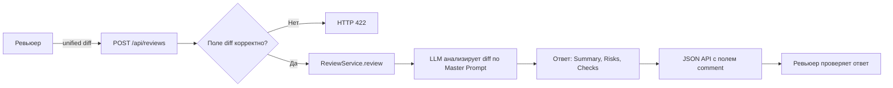

# Анализ процесса: AS IS и TO BE

Файл ведёт OpenCode. Обсудите с агентом содержание и проверьте предложенный diff. Все дополнения и исправления поручайте агенту в чате.

## AS IS

В рамках учебного кейса:

- Вход: один unified diff PR (TRAINING_PR.diff).
- Пользователь: ревьюер.
- Сервис: FastAPI-приложение с POST /api/reviews, принимающее payload: dict и обращающееся к review_service.review(payload["diff"]).
- Логика: ReviewService.builds prompt "Review this pull request and find problems:\n{diff}", вызывает llm.generate и возвращает {"comment": answer}.
- Точки риска по diff:
  - app/api.py:35-37 — обращение к payload["diff"] без валидации вызывает KeyError при отсутствии ключа и приводит к 500.
  - Структура ответа сервиса — один ключ comment, без структурированных полей summary/risks/checks.

## TO BE

Один целевой процесс (без навязывания требований к версии Python и реализации клиента LLM):

- Вход в сервис: тело запроса с полем diff: str валидируется (например, схемой запроса). При отсутствии поля возвращается 422.
- Сервис вызывает ReviewService.review(diff) и возвращает JSON с полем comment, которое содержит структуру summary, risks, checks.
- Для ассистента ревьюера: применяется Master Prompt v1; результат согласован с форматом ответа API: summary, до 3 risks с file/line/evidence, и checks.

## Разница

| Что меняется | AS IS | TO BE | Как проверим изменение |
|---|---|---|---|
| Валидируем вход | Нет — payload["diff"] даёт KeyError | Есть — отсутствующее поле -> 422 | Негативная проверка C1 (см. Checks), ожидаем 422 в TO BE |
| Формат вывода ассистента | Свободный/несогласованный | Строгий: Summary, Risks<=3, Checks | Сравнить P1-01 vs P1-02 |
| Ссылки/доказательства | Частично | Обязательны: file/line/evidence | Проверка журналов и ответов |

## Как использовали AI

 - Для чего: оформить AS IS/TO BE процесс по diff, согласовать формат ответа API и зафиксировать изменения и проверки.
- Тип промпта: master prompt (P1-02)
- Строка в [`prompts.md`](prompts.md): P1-02, P1-03
- Что проверил студент и какие исправления поручил агенту: оформлен процесс AS IS/TO BE; проверено соответствие мастер промпту и diff; уточнён формат ответа API (comment{summary, risks, checks}); требования к версии Python и синхронности отмечены как открытые вопросы.
