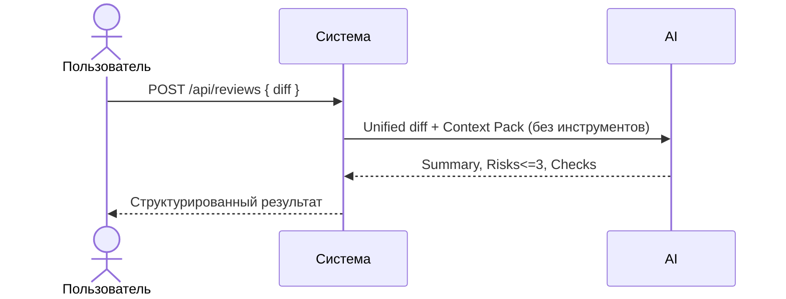

# Use cases и user stories

Файл ведёт OpenCode. Обсудите с агентом содержание и проверьте предложенный diff. Все дополнения и исправления поручайте агенту в чате.

## Первый рабочий сценарий

**Когда** ревьюер получает diff одного PR и хочет быстро оценить риски, **система** принимает diff и запускает ассистента, **а пользователь получает** краткое summary, не более 3 проверяемых рисков с ссылками на строки и список проверок.

Не входит в этот сценарий:

- approve/merge PR; изменения кода; предположения без доказательств; выход за пределы diff.

## Use case

| Поле | Значение |
|---|---|
| Актор | Ревьюер |
| Триггер | Есть unified diff PR (TRAINING_PR.diff) |
| Предусловия | Доступен endpoint POST /api/reviews; ассистент использует Master Prompt v1 |
| Основной результат | Ответ API: JSON с полем comment, внутри comment структура summary, risks (<=3) с file/line/evidence, checks |
| Ошибка или отказ | Отсутствует поле diff в теле — возврат ошибки валидации (см. Checks) |



## User stories и acceptance criteria

```gherkin
Feature:

  Scenario: Позитивный
    Given endpoint /api/reviews доступен
    And в теле запроса есть поле diff с валидным unified diff
    When ревьюер отправляет POST /api/reviews
    Then ассистент возвращает Summary, до 3 Risks с file/line/evidence, и Checks

  Scenario: Негативный (отсутствует diff)
    Given endpoint /api/reviews доступен
    And в теле запроса отсутствует поле diff
    When ревьюер отправляет POST /api/reviews с {}
    Then система возвращает ошибку (в AS IS — 500 KeyError; в TO BE — 422)
```

## Как использовали AI

 - Для чего: описать первый рабочий сценарий, use case и user stories по diff и согласованному Master Prompt v1.
- Тип промпта: master prompt (P1-02)
- Строка в [`prompts.md`](prompts.md): P1-02, P1-03
- Что проверил студент и какие исправления поручил агенту: сценарии согласованы с diff и Master Prompt v1; уточнён формат ответа API (comment{summary, risks, checks}).
