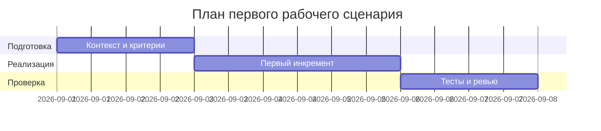

# План поставки

Файл ведёт OpenCode. Обсудите с агентом содержание и проверьте предложенный diff. Все дополнения и исправления поручайте агенту в чате.

## Инкременты и ответственность

| Инкремент | Наблюдаемый результат | Что делает человек | Что делает AI или субагент | Проверка | Зависимости |
|---|---|---|---|---|---|
| 1 | Endpoint /api/reviews принимает валидный diff и возвращает JSON {comment: {summary, risks, checks}} | Определяет схему запроса и формата ответа, пишет валидацию | Генерирует подсказки для схемы и примеры | Unit/Integration tests проходят | TRAINING_PR.diff как исходная база |
| 2 | Ассистент выдаёт структурированный результат | Уточняет Master Prompt и Context Pack | Выполняет Master Prompt | P1-02 формат соблюдён | Инкремент 1 |
| 3 | Документация и тестовые сценарии согласованы | Финализирует ADR, сценарии и тесты | Предлагает улучшения формулировок | make step1 OK | Инкременты 1–2 |

## Диаграмма Ганта

Передайте OpenCode даты и задачи своего плана и попросите обновить диаграмму.

## Как использовали AI

 - Для чего: спланировать инкременты поставки продукта (валидация входа, формат ответа, документация/тесты) и привязать проверки.
- Тип промпта: zero-shot (P1-01), master prompt (P1-02)
- Строка в [`prompts.md`](prompts.md): P1-01, P1-02, P1-03
- Что проверил студент и какие исправления поручил агенту: уточнён план поставки продукта (а не экспериментов), фиксация формата ответа API и согласование тестов.
