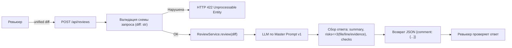

# Few-shot

Файл ведёт OpenCode по вашим запросам. Агент записывает фактические результаты экспериментов и вносит изменения в связанные файлы. Свою оценку сообщайте ему в чате; вручную заполнять шаблон не нужно.

- Артефакт Практики 1: practices/practice_01/analysis.md
- Что хотим улучшить: уточнить TO BE, диаграмму и критерии проверяемости; сделать формулировки проверяемыми и непротиворечивыми относительно context.md, product_management.md и tests_*

## Примеры

### Хороший результат

TO BE: «Сервис возвращает JSON {comment: {summary, risks (<=3), checks}}; каждое risk содержит file, line и evidence — цитату из diff.»

«Как проверим изменение»: «Integration: POST /api/reviews с {} -> 422 (TO BE), а в AS IS -> 500. E2E позитивный: POST /api/reviews c валидным diff -> comment.summary присутствует; у каждого risk указаны file:line и цитата.»

Диаграмма: содержит узел «Валидация схемы запроса» перед развилкой и явную ветку 422.

### Плохой результат

TO BE: «Сервис возвращает понятный результат и валидирует вход.»

«Как проверим изменение»: «Запустить и посмотреть, что всё работает.»

Диаграмма: без развилки по валидации, не отражает 422.

## Запрос

Роль: Старший редактор SDLC-артефактов

Задача: Предложить уточнённую версию раздела TO BE, диаграммы и таблицы «Разница» для файла practices/practice_01/analysis.md. Цель — сделать формулировки проверяемыми и непротиворечивыми относительно связанных артефактов (context.md, product_management.md, tests_*). Не изменяй исходные файлы, просто предложи текст для замены/добавления.

Требования к результату:
- Верни три блока: (1) обновлённый раздел TO BE, (2) диаграмма Mermaid, (3) таблица «Разница» с воспроизводимыми «Как проверим изменение».
- Сохраняй согласованность с context.md, product_management.md и tests_*; не вводи новых требований вне учебного кейса.
- Используй краткие, проверяемые формулировки. Только готовый текст для подстановки.

## Что получили

### Предложенный TO BE

- Один целевой процесс (без требований к версии Python и реализации клиента LLM).
- Вход: тело запроса — JSON-объект c полем diff: str. Поле валидируется схемой запроса. При отсутствии поля diff или несоответствии типа возвращается 422 Unprocessable Entity.
- Обработка: сервис вызывает ReviewService.review(diff). ReviewService формирует промпт вида:
  "Review this pull request and find problems:\n{diff}", вызывает llm.generate и приводит ответ к согласованному формату.
- Выход: JSON с одним верхнеуровневым полем comment. Поле comment — объект со структурой:
  - summary: краткое описание изменения;
  - risks: массив до 3 элементов; каждый элемент содержит:
    - file (строка),
    - line (номер или диапазон строк),
    - evidence (цитата из unified diff, подтверждающая вывод);
  - checks: список воспроизводимых проверок (шаги и ожидаемые результаты).
- Правила: запрещены предположения без ссылки на diff/источник; решение принимает человек. Формат результата и ограничения соответствуют context.md и product_management.md; для генерации используется Master Prompt v1 (см. P1-02).

### Диаграмма

### Таблица «Разница»

| Что меняется | AS IS | TO BE | Как проверим изменение |
|---|---|---|---|
| Валидация входа | Нет — payload["diff"] выбрасывает KeyError | Есть — отсутствие/невалидное поле diff -> 422 | Интеграционный негатив: POST /api/reviews c {}. AS IS: 500 (KeyError). TO BE: 422. См. Checks C1 в P1-02 |
| Формат ответа API | {"comment": строка}, несогласованный | {"comment": {summary, risks<=3, checks}} | E2E позитивный: POST /api/reviews с валидным diff. Ожидаем: comment.summary присутствует; risks длиной ≤3; у каждого risk есть file, line, evidence (цитата). Подтверждение: P1-02.json |
| Ограничение на риски и доказательства | Риски не структурированы; ссылки не обязательны | До 3 рисков, каждый с file/line и обязательной evidence (цитатой из diff) | Просмотр P1-02.json: у каждого risk есть file, line, evidence; количество рисков ≤3 |
| Использование Master Prompt | Не зафиксировано | Зафиксирован Master Prompt v1 | Сравнить P1-01 и P1-02: во втором соблюдён структурированный формат и ссылки на diff |

## Что изменили в исходном артефакте

- Файл и раздел: practices/practice_01/analysis.md — раздел TO BE, диаграмма Mermaid и таблица «Разница»
- Изменение: уточнили TO BE (валидация diff -> 422, структура comment{summary, risks<=3(file/line/evidence), checks}, правила согласования с context/product_management), обновили диаграмму с явной валидацией и веткой 422, конкретизировали «Как проверим изменение» в таблице
- Как проверили: визуально сверили соответствие с context.md и product_management.md; в таблице «Разница» добавлены воспроизводимые проверки (интеграционный негатив 422, e2e позитивный с форматом comment); make step2 будет выполнен после завершения всех эксперименов
- Что отклонили: расплывчатые формулировки («понятный результат», «валидирует вход») и диаграмму без узла валидации и явной ветки 422
